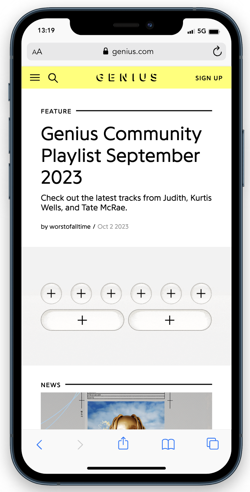
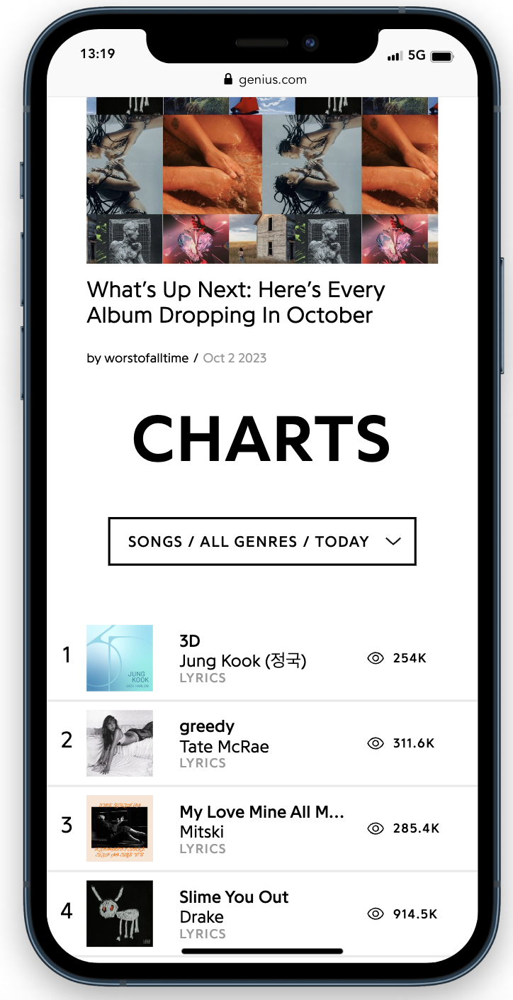
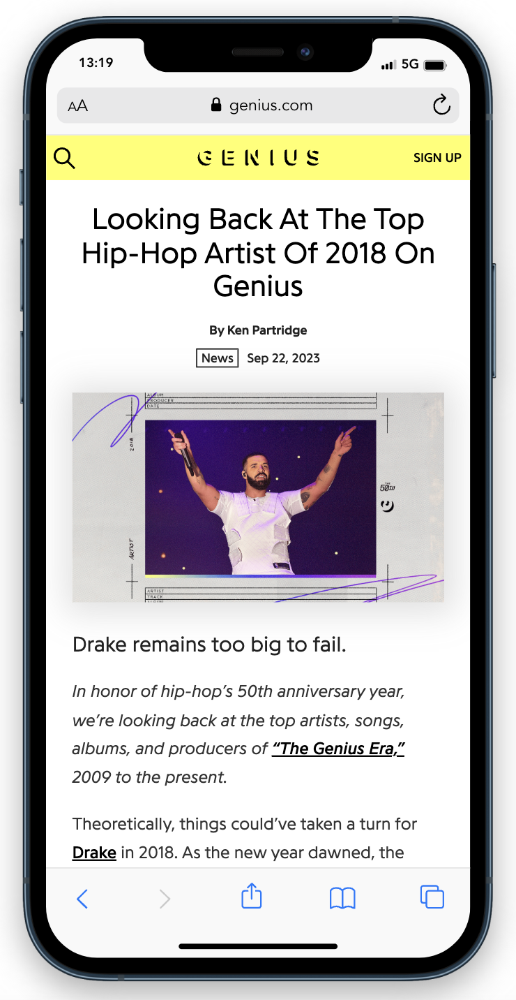
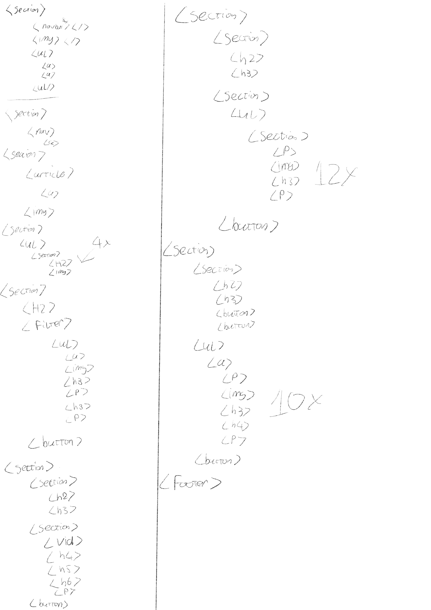
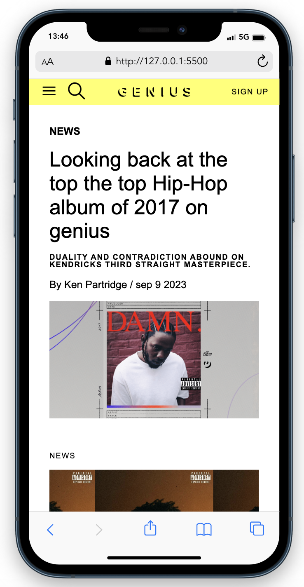
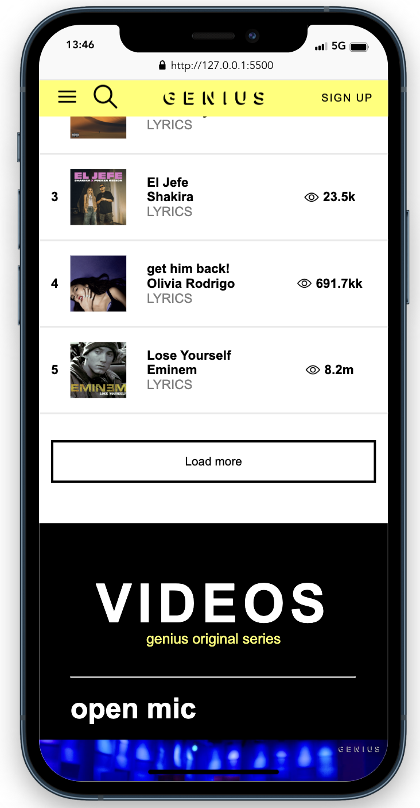
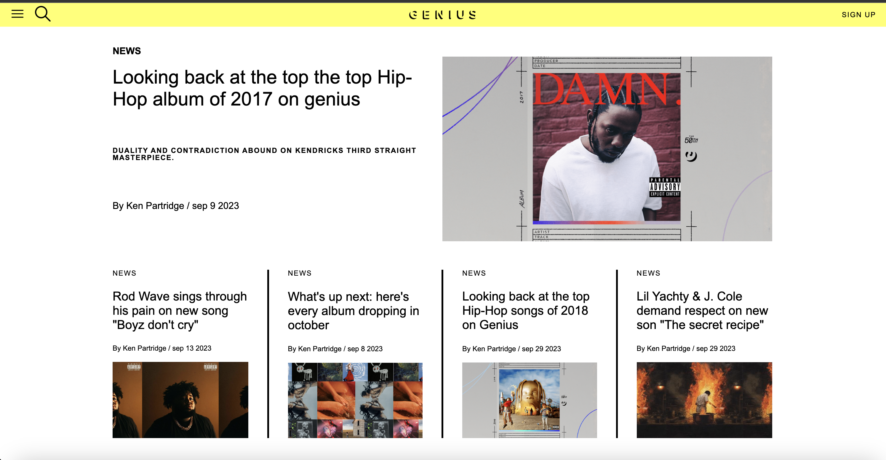
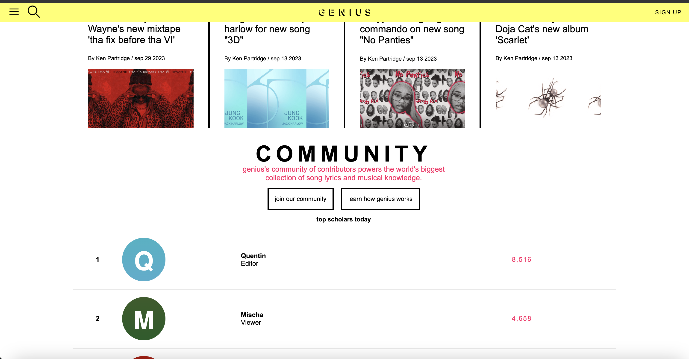
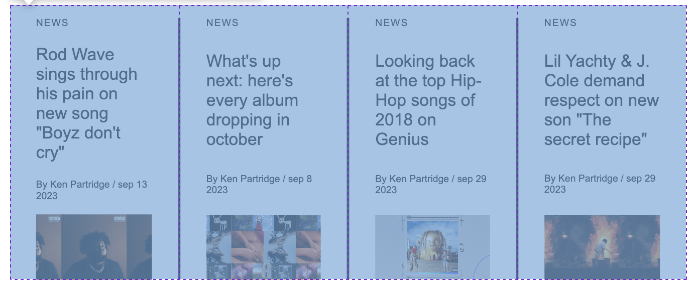

# Procesverslag
Markdown is een simpele manier om HTML te schrijven.  
Markdown cheat cheet: [Hulp bij het schrijven van Markdown](https://github.com/adam-p/markdown-here/wiki/Markdown-Cheatsheet).

Nb. De standaardstructuur en de spartaanse opmaak van de README.md zijn helemaal prima. Het gaat om de inhoud van je procesverslag. Besteedt de tijd voor pracht en praal aan je website.

Nb. Door *open* toe te voegen aan een *details* element kun je deze standaard open zetten. Fijn om dat steeds voor de relevante stuk(ken) te doen.

## Jij

  
uitwerken voor kick-off werkgroep

  ### Auteur:
  Mischa Melkert

  #### Je startniveau:
  Rood

  #### Je focus:
  Responsive design
 

## Je website

  
uitwerken voor kick-off werkgroep

  ### Je opdracht:
  https://genius.com/

  #### Screenshot(s) van de eerste pagina (small screen): 
  Genius home pagina
  
  

  #### Screenshot(s) van de tweede pagina (small screen):
  Genius blog pagina 
  
 

## Toegankelijkheidstest 1/2 (week 1)

  
uitwerken na test in 2e werkgroep

  ### Bevindingen
  Lijst met je bevindingen die in de test naar voren kwamen:
  De grootste bevinding die naar voren kwam is dat de door mij gekozen website zelf helemaal niet responsive is. Zodra je het scherm verkleind is duidelijk te zien dat content wordt afgesneden van de pagina en het eigenlijk niet meer werkend is.
  Dit was voor mij al reden genoeg om te bepalen dat ik voor het responsive design ging doordat dit mijn grootste verbetering is voor aan de website.

  Ook is er te zien dat de pagina helemaal geen alt atributen gebruiken en list elementen worden ook niet gebruikt op de plekken waar het wel kan/hoort. Hiervoor gebruiken ze namelijk een div met een class naam.

  Verder ziet de website er wel keurig uit met hier en daar een paar kleine verbeter puntjes, maar het komt zeker niet door de checklist.

## Breakdownschets (week 1)

  
uitwerken na afloop 3e werkgroep

  ### de hele pagina: 
  

  De schets die gemaakt is was erg hulpzaam. Ik heb deze aan het begin gemaakt en ook heb ik hier regelmatig nog op terug gekeken en over nagedacht hoe een website nou in elkaar zit. Ik weet zeker dat ik dit volgende keer ga meenemen mocht ik bijvoorbeeld mijn eigen website in elkaar zetten.

## Voortgang 1 (week 2)

  
uitwerken voor 1e voortgang

  ### Stand van zaken
  hier dit ging goed & dit was lastig (neem ook screenshots op van delen van je website en code)

  Wat er goed ging is dat ik al lekker snel een begin had gemaakt van mijn header. Deze heb ik redelijk snel in elkaar kunnen zetten zodat dat alvast gedaan was. Een eigen minpunt van mijn manier van werken is dat ik niet als eerste de hele html doe maar per blok de css doe en dan weer het volgende html gedeelte.

  In de onderstaande afbeelding is ook te zien dat ik volledig de header gemaakt had nog niet besseffende dat ik het eerst op mobiel formaat moet doen. 

  ### Verslag van meeting
  hier na afloop snel de uitkomsten van de meeting vastleggen

  - punt 1: Mobiel formaat werken
  - punt 2: html helemaal invullen voordat je aan css gaat
  - punt 3: bedenken hoe ik de header responsive kan maken
  

## Voortgang 2 (week 3)

  
uitwerken voor 2e voortgang

  ### Stand van zaken
  In deze week kregen we in de les te horen hoe we een responsive nav menu kunnen maken. Deze oefeningen heb ik gedaan in de les en die heb ik meegenomen naar mijn eigen site. Doordat een mobiel formaat klein is wil ik een werken menu bar hebben met behulp van JS. Hierdoor heb ik nog niet echt de tijd gehad om html erin te zetten maar kon ik wel verder met mijn mobiel formaat.

  ### Verslag van meeting
  hier na afloop snel de uitkomsten van de meeting vastleggen

  - punt 1: HTML nog steeds invullen
  - punt 2: Meer aan display grid denken.
  

## Toegankelijkheidstest 2/2 (week 4)

  
uitwerken na test in 9e werkgroep

  ### Bevindingen
  Lijst met je bevindingen die in de test naar voren kwamen (geef ook aan wat er verbeterd is):

  De punten die nu al sterk verbeterd zijn is dat er in de html geen foutmeldingen zitten. Dit komt onder andere doordat er een alt tag in een img zit.

  Op dit moment heb ik nog niet veel gewerkt aan het responsive designen maar dat zal nu van start gaan.

  Ook heb ik meer gebruik gemaakt van duidelijke H elementen doordat er vrij weinig te vinden waren.

## Voortgang 3 (week 4)

  
uitwerken voor 3e voortgang

  ### Stand van zaken
  Voortgang van deze week was heel goed. Ik heb me heel erg gericht op het afmaken van mijn mobiele versies van de sites en nu is het tijd om aan de slag te gaan met @media om het responsive te maken. De pagina's zien er op dit moment zo uit:

  ### Verslag van meeting
  hier na afloop snel de uitkomsten van de meeting vastleggen

  - punt 1: snel beginnen met responsive omdat dit tijd kan opnemen
  - punt 2: Misschien voortaan het responsive al eerder doen
  
  

## Eindgesprek (week 5)

  
uitwerken voor eindgesprek

  ### Je uitkomst - karakteristiek screenshots:
  
  
  
  

  ### Dit ging goed/Heb ik geleerd: 
  Ik heb geleerd hoe ik met grid moet werken. En ook hoe ik deze responsive moet maken.

  De laatste twee tabjes worden onzichtbaar op mobiel versie omdat het anders te groot wordt de pagina en te veel een lijst. Dit is 1 van de onderdelen die ik responsive heb gemaakt.

  

  ### Dit was lastig/Is niet gelukt:
  Wat bij mij niet helemaal goed ging is dat ik dus te laat dacht aan grid en aan responsive ontwerpen. Ik heb dit op een bepaalde hoogte goed kunnen oplossen achteraf maar het had me veel meer tijd kunnen schelen. 
  Ik wil graag dat alle secties in een zelfde grid template staan maar dat was voor deze site heel lastig uit te werken waardoor ik dus een beetje creatief moest wezen af en toe.
  Als ik de volgende keer aan de slag ga wil ik nog minder met flexbox werken.

## Bronnenlijst

  
continu bijhouden terwijl je werkt

  Nb. Wees specifiek ('css-tricks' als bron is bijv. niet specifiek genoeg). 
  Nb. ChatGpT en andere AI horen er ook bij.
  Nb. Vermeld de bronnen ook in je code.

  1. bron 1: https://genius.com/
  2. bron 2: https://cssgridgarden.com/
  3. bron 3: https://cssgrid-generator.netlify.app/ 
  4. bron 4: https://www.scaler.com/topics/center-a-button-in-html/ 

